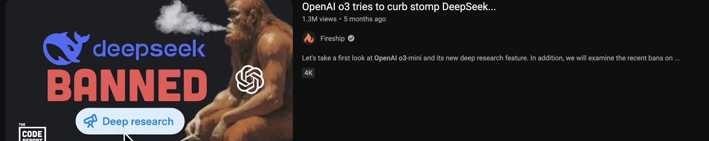
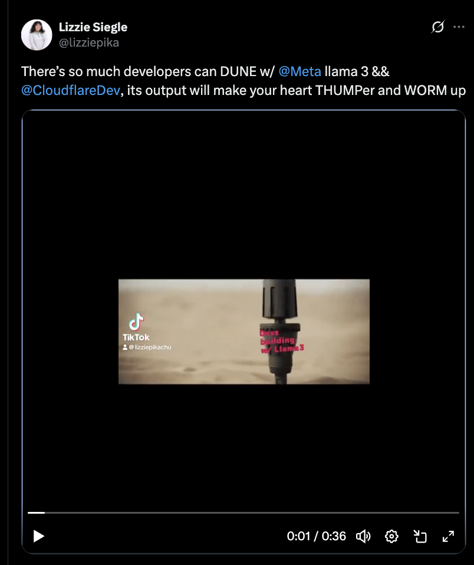

# Piggybacking for Popularity: Crafting Demos That Ride the Hype Wave

---
- [ ] $whoami?

- [ ] capitalize on current trends && lessons learned

- [ ] What is Piggybacking? 🐷

    Building content that **rides the momentum of existing hype**—e.g.:
- trending event (e.g. [March Madness](https://www.youtube.com/watch?v=OTvfjudifDg), sports finals, Oscars)
- product launch (e.g. [Llama 4🦙 on Cloudflare Workers AI](https://x.com/lizziepika/status/1908916241315561779/video/1))
- pop culture (e.g.🎥🍿)
- viral meme || Tiktok sound
- a holiday (e.g. [Mean Girls Day](https://x.com/lizziepika/status/1841965146081787931/), [Thanksgiving](https://www.twilio.com/en-us/blog/developers/tutorials/integrations/safe-to-say-at-thanksgiving-transfer-learning-sms), [Intl Talk Like a Pirate Day](https://www.twilio.com/en-us/blog/developers/tutorials/integrations/translator-via-sms-with-c-and-azure-functions))

---

- [ ] Why Piggyback?

- **Social media > SEO**  
  Timely content spreads faster than perfect content.

- **Mind-share is fleeting**  
  Trends are short-lived. Attention is a currency—strike while hot.

---

- [ ] Case Studies

<strong>1. Using Python and Twilio Messaging to find out if the Suez Canal is still blocked</strong>

- [Blog post](https://www.twilio.com/en-us/blog/developers/tutorials/integrations/using-python-and-twilio-messaging-to-find-out-if-the-suez-canal-is-still-stuck)  
- **Lesson:** Be entertaining.

<strong>2. 📱 ChatGPT SMS (Built on a cruise🚢) && Gemini Multimodal Chat</strong>

- [GitHub Repo](https://github.com/elizabethsiegle/chatGPT-SMS-js)  
- [Twitter video](https://x.com/lizziepika/status/1611061717701693456) 
- [Video](https://x.com/lizziepika/status/1736092971748192516)  
- [GitHub Repo](https://github.com/elizabethsiegle/gemini-multimodal-chat/) 
- Simple uses but good timing and I was the first: built and posted the *same night* a new Gemini model dropped  
- **Lesson:** *Timing beats complexity. Be early, even if it’s simple.*

<strong>3. Dune + Cloudflare Workers AI (Thumper meme)</strong>

- 
- Filmed in Hawaii during week 2 @ Cloudflare 
- [Video link](https://x.com/lizziepika/status/1782516871264387430)   
- **Lesson:** *It’s not always your timeline** | Trends can come whenever.*

<strong>4. Porter Robinson Secret Sky interactive geo-map app </strong>

- [Interactive user map app](https://x.com/doctorkawaii/status/1283571964037050368) 
- **Lesson:** *Niche communities *really* show up! x timing x interactivity* 

<strong>5. Python🐍 SMS☎️ Sea Shanty </strong>

- [Sea Shanty SMS TikTok](https://x.com/lizziepika/status/1350874684200757249) 
- **Lesson:** *Remix what's already popular. Catchy.* 

- [ ] Rapid-Fire Demos

- **Always be building** | Treat demos like sketches. Don’t wait for “perfect.” 

- **Ship like no one’s watching** | !everything lands. That's ok.

- **Be authentic** | Your energy and enthusiasm matter. Lean into it. 

| Demo | What | Lesson |
|------|------|--------|
| [Wordle SMS](https://github.com/elizabethsiegle/wordle-sms) | Built in 1 day during Wordle mania | *Hustle to match the moment.* |
| [Stephen Smith-ify Commentary](https://x.com/lizziepika/status/1735375100357296580/video/1) | Audio commentary + GPT-4V | *Use pop culture hooks to have fun.* |
| [NBA Finals Voting App](https://github.com/elizabethsiegle/nba-finals-poll) | Stateful poll with Workers AI + Hono | *People love interactive content.* |
| [International Joke Day Generator](https://github.com/elizabethsiegle/joke-day-ai) | AI joke gen app | *Even small efforts help you stay visible.* |
| [Mask Detector with ml5.js](https://x.com/i/status/1417647739295322113) | Visual mask-detection demo as masks returned | *Visual + relevant = share magnet.* |

- [ ] How to Measure Success

- GitHub: ⭐️ stars, 👀 watchers, forks🍴  
- Hacker News: Upvotes + comments  
- IRL: Signal boosts from coworkers, product teams, devs, communities
- Developer ❤️
---

## 🧠 Final Takeaway
> Why do you build?

> **Build fast. Tie it to the moment. Have fun.** 

> People can tell—and it’s contagious and gets people talking.

